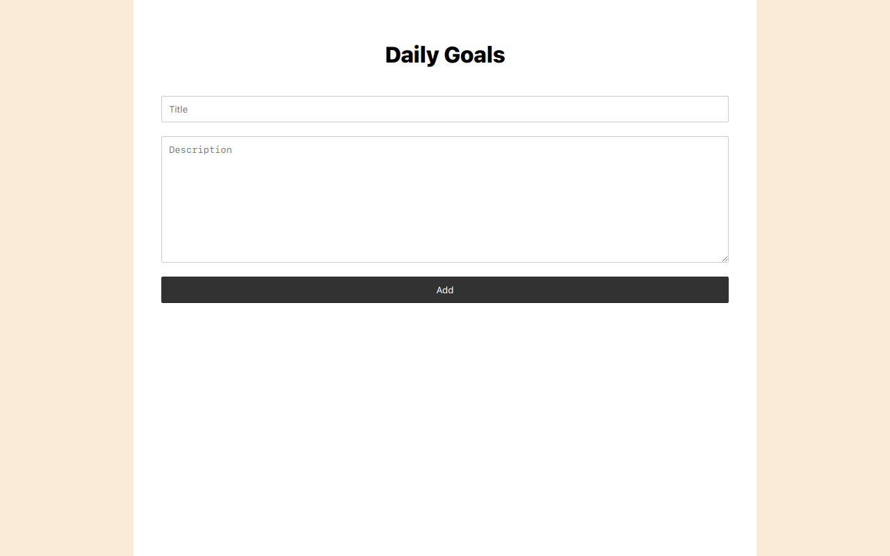

# Daily Goal Web App

## Overview

Welcome to the Daily Goal Web App project! This app allows users to enter their daily goals, delete them individually, and ensures that goals persist even after refreshing the browser. Built with HTML, CSS, and JavaScript, this project showcases the power of DOM manipulation and local storage.

### Table of Contents

- [Installation](#installation)
- [How to use](#how-to-use)
- [Technologies Used](#technologies-used)
- [Features](#features)
- [Project Structure](#project-structure)
- [Credits](#credits)
- [License](#license)



## Installation

To run this project locally, follow these steps:

1. Clone the repository to your local machine.
    ```bash
    git clone https://github.com/m-ramzan786/Daily-Goal.git
    ```

2. Open the project folder in your code editor.

3. Open the `index.html` file in your web browser.

## How to Use

To use the Daily Goal Web App:

1. Open the [live demo](https://daily-goal.vercel.app/) or run it locally.

2. Use the title and description inputs to enter your daily goal.

3. Click the "Add" button to add the goal to your list.

4. Click the "-" button next to each goal to remove them individually.

## Technologies Used

- HTML
- CSS
- JavaScript (DOM manipulation and local storage)

## Features

- **Goal Entry:** Users can enter daily goals using title and description inputs.

- **Goal Deletion:** Goals can be deleted one by one for a tidy list.

- **Persistent Storage:** Goals are stored in local storage, ensuring visibility even after a browser refresh.

- **User-Friendly Interface:** Simple design for ease of use.

- **Responsive:** Responsive design for various screen sizes.

## Project Structure

The project is structured for easy navigation, featuring a clean and responsive design.

## Local Storage Implementation

The JavaScript code includes local storage functionality to ensure that entered goals persist even after refreshing the browser.

## Credits

- [Muhammad Ramzan](https://github.com/m-ramzan786) - Project Creator

## License

This project is licensed under the [MIT License](LICENSE). Feel free to use and modify the code as per the license terms.

## Badges


## How to Contribute

If you'd like to contribute to the project, follow these steps:

1. Fork the project.
2. Create a new branch for your feature: `git checkout -b feature-name`.
3. Commit your changes: `git commit -m 'Add new feature'`.
4. Push to the branch: `git push origin feature-name`.
5. Open a pull request.

## Contact

If you have any questions, suggestions, or just want to connect, feel free to reach out:

- Email: [mramzanstv@gmail.com](mramzanstv@gmail.com)
- Portfolio: [Muhammad-Ramzan-Portfolio](https://muhammad-ramzan.vercel.app/)
- LinkedIn: [in/m-ramzan786](https://www.linkedin.com/in/m-ramzan786/)

## Tests

The project includes a set of tests to ensure the functionality is working as expected. To run the tests, use the following command:
```bash
npm test
```

Happy goal-setting!
